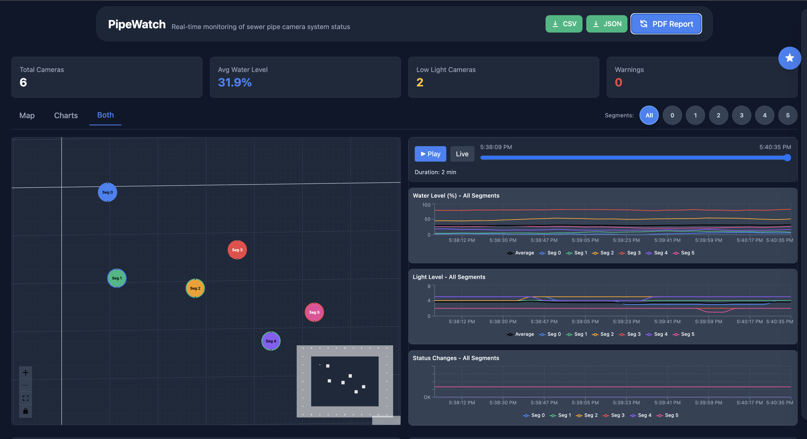
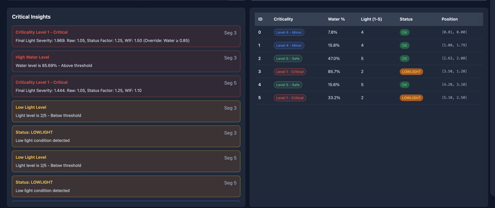
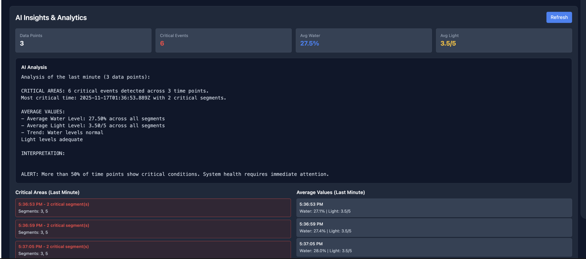

# PipeWatch - Sewer Camera Monitoring System





A comprehensive React + TypeScript application for real-time monitoring of sewer pipe camera systems. This application provides interactive map visualization, trend analysis, AI-powered insights, and detailed reporting capabilities.

## Features

### Core Functionality
- **Interactive Map Visualization**: Coordinate-based map using React Flow with circular segment nodes
- **Real-time Updates**: WebSocket integration for live camera data updates (every 6 seconds)
- **Historical Data Playback**: Timeline slider to scrub through the last 60 seconds of sensor history
- **Trend Charts**: Time-series visualization for water levels, light levels, and status changes using Recharts
- **Segment Selection**: Multiple ways to select segments (map click, hover, or circular buttons)

### Analytics & Insights
- **AI Insights & Analytics Panel**: Floating sidebar with AI-generated analysis, critical areas, and average values
- **Criticality System**: Sensor-weighted criticality calculation based on Light, Water, and Status
- **Insights Dashboard**: Overview of system health metrics with severity-based insights
- **Detailed Camera Table**: Sortable table with comprehensive camera data

### Data Export & Reporting
- **PDF Report Generation**: Comprehensive inspection reports with AI-generated summaries, critical areas table, and dashboard screenshots
- **CSV/JSON Export**: Export last 1 minute of historical data
- **Full-page Screenshots**: Capture entire dashboard for documentation

### User Interface
- **Dark Mode Theme**: Professional engineering monitoring theme with high contrast colors
- **Tab-based Layout**: Switch between Map, Charts, or Both views
- **Segment Filter Buttons**: Quick selection buttons in the tab bar
- **Hover Tooltips**: Detailed segment information on map hover
- **Responsive Design**: Works on desktop and tablet devices

## Tech Stack

**Frontend:**
- React 19 + TypeScript
- Vite (build tool with SWC)
- Tailwind CSS v4 (styling)
- React Flow (map/node visualization)
- Recharts (time-series charts)
- TanStack Query (data fetching and caching)
- Axios (HTTP client)
- html2canvas-pro + jsPDF (PDF report generation)

**Backend:**
- Express.js (REST API)
- WebSocket (ws) (real-time updates)
- TypeScript (type-safe server code)
- tsx (TypeScript execution)

**Development:**
- ESLint (code linting)
- Nodemon (auto-restart for server)
- PostCSS (CSS processing)

## Getting Started

### Prerequisites

- Node.js (v20.19.0 or >=22.12.0 recommended)
- npm or yarn

### Installation

1. Install dependencies:
```bash
npm install
```

### Running the Application

You need to run both the frontend and backend server:

**Terminal 1 - Backend Server:**
```bash
npm run dev:server
```

**Terminal 2 - Frontend:**
```bash
npm run dev
```

The application will be available at:
- Frontend: http://localhost:5173
- Backend API: http://localhost:4000
- WebSocket: ws://localhost:4000

## Project Structure

```
src/
├── api/                    # API service layer
│   ├── types.ts            # TypeScript interfaces
│   └── cameraService.ts     # REST API client
├── components/             # React components
│   ├── MapView.tsx         # Main map visualization
│   ├── CameraTooltip.tsx   # Tooltip component
│   ├── Dashboard.tsx       # Insights dashboard
│   ├── CameraTable.tsx     # Sortable data table
│   ├── TrendCharts.tsx     # Time-series charts
│   ├── PlaybackControls.tsx # Timeline playback controls
│   ├── MapAndChartsLayout.tsx # Tab-based layout
│   ├── Header.tsx          # Application header with exports
│   ├── InsightsCard.tsx     # Segment insights display
│   ├── InsightsPanel.tsx    # Floating AI insights sidebar
│   └── InsightsPanelInline.tsx # Inline insights for PDF
├── hooks/                  # Custom React hooks
│   ├── useCameraData.ts    # Camera data fetching
│   ├── useWebSocket.ts     # WebSocket connection
│   ├── useHistoricalData.ts # Historical data management
│   └── useScreenshot.ts    # PDF report generation
├── pages/                  # Page components
│   └── DashboardPage.tsx   # Main dashboard page
└── utils/                  # Utility functions
    ├── insights.ts          # Insight calculations
    ├── criticality.ts      # Criticality system
    └── colors.ts           # Segment color mapping

server/
├── server.ts               # Express + WebSocket server
└── seed.json               # Sample camera data
```

## Camera Data Structure

Each camera entry contains:
- `Position`: [X, Y] coordinates relative to starting point (0,0)
- `SegmentID`: Unique identifier for the camera
- `Water`: Water submersion percentage (0-1)
- `Light`: Light level (1-5 scale, where 5 is brightest)
- `Status`: Camera status (OK, LOWLIGHT, WARNING)
- `ViewDescription`: Optional descriptive text

## Coordinate System

- Starting point: (0, 0)
- X > 0: Right of starting point
- Y > 0: Downward from starting point
- Negative values: Exit points (-1)

## Status Indicators

- **OK** (Green): Normal operation
- **LOWLIGHT** (Yellow): Insufficient lighting detected (Light ≤ 2)
- **WARNING** (Red): High water level (>0.8) or critical issue

## Criticality Levels

The system calculates criticality (1-5) based on:
- Light level (1-5 scale)
- Water submersion percentage
- Camera status
- Override conditions (high water, warning status, etc.)

Levels:
- **Level 1 - Critical**: Immediate attention required
- **Level 2 - Severe**: High priority
- **Level 3 - Moderate**: Monitor closely
- **Level 4 - Minor**: Low priority
- **Level 5 - Safe**: Normal operation

## API Endpoints

### REST API
- `GET /api/cameras` - Get current camera data
- `GET /api/history` - Get historical data (last 60 seconds)
- `GET /api/export/csv` - Export data as CSV
- `GET /api/export/json` - Export data as JSON
- `GET /api/insights` - Get AI insights and analytics

### WebSocket
- Real-time camera updates every 6 seconds
- Historical data stored for last 60 seconds

## Usage

### Selecting Segments
- **Map Click**: Click on a segment node to select/deselect
- **Map Hover**: Hover over a segment to temporarily select it
- **Segment Buttons**: Use circular buttons in the tab bar (Both tab only)

### Viewing Trends
- Select a segment to view its individual trends
- Deselect to view aggregated trends for all segments
- Use playback controls to scrub through historical data

### Generating Reports
- Click "PDF Report" in the header to generate a comprehensive inspection report
- Report includes AI-generated summary, critical areas table, insights, and dashboard screenshot

### Exporting Data
- Click "CSV" or "JSON" buttons to export the last 1 minute of data
- Data includes all segments with timestamps

## Development

### Building for Production

```bash
npm run build
```

### Preview Production Build

```bash
npm run preview
```

## Key Features Implemented

✅ Historical data playback with timeline slider  
✅ Trend charts for water, light, and status  
✅ AI-powered insights and analytics  
✅ PDF report generation with AI summaries  
✅ CSV/JSON data export  
✅ Criticality-based risk assessment  
✅ Dark mode safety monitoring theme  
✅ Segment selection via multiple methods  
✅ Real-time WebSocket updates  
✅ Sortable camera data table  

## Competition Notes

This application is designed for the Engineering Competition 2025 Programming Category. It demonstrates:

- Clean, maintainable code architecture
- Real-time data visualization
- Consumer-friendly interface
- REST API and WebSocket integration
- Responsive design with modern UI
- AI-powered analytics and insights
- Comprehensive reporting capabilities
- Professional monitoring dashboard design
